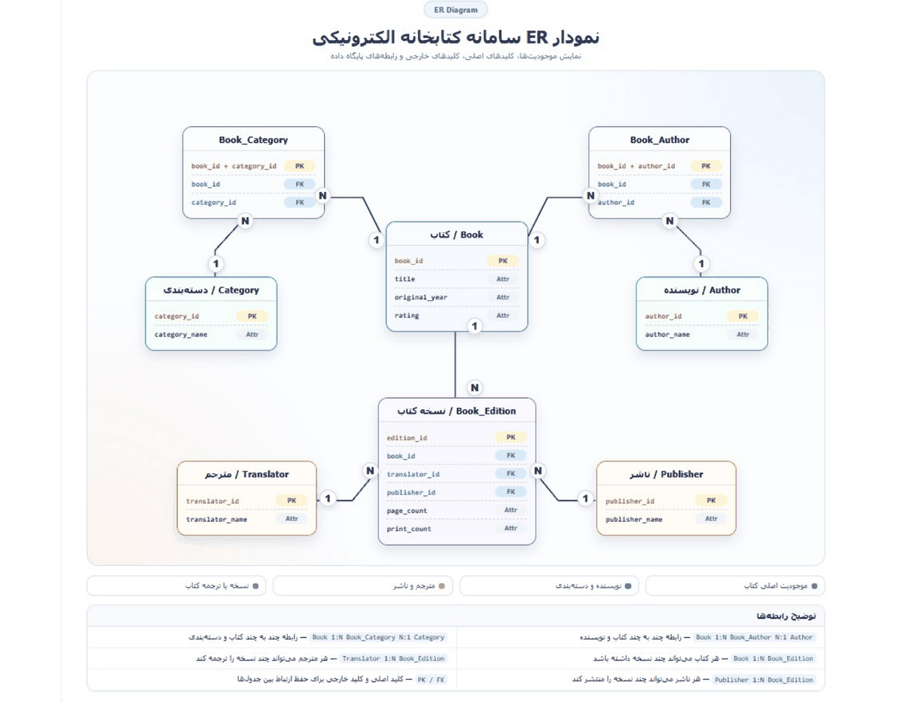

# پایگاه دادهٔ کتابخانهٔ الکترونیکی

<div dir="rtl">

پروژهٔ درس پایگاه داده، تهیه‌شده توسط **محمدماهان صفائیان**؛ از تعریف نیازمندی‌ها و طراحی ER تا ساخت جدول‌ها در MySQL و نوشتن Queryهای نمونه.

</div>

[English README](README.md) · [گزارش پروژه](docs/project-report.pdf) · [نمودار ER](docs/er-diagram.pdf)



## معرفی پروژه

<div dir="rtl">

این پایگاه داده برای مدیریت اطلاعات کتاب‌ها، نویسنده‌ها، دسته‌بندی‌ها، مترجم‌ها، ناشرها و نسخه‌های مختلف کتاب طراحی شده است. جدا کردن اطلاعات کتاب از نسخهٔ آن باعث می‌شود یک کتاب بتواند ترجمه‌ها یا نسخه‌های متفاوتی داشته باشد، بدون اینکه اطلاعات اصلی کتاب تکرار شود.

ساختار شامل **۸ جدول** است: شش جدول اصلی و دو جدول واسط. رابطهٔ کتاب با نویسنده و دسته‌بندی از نوع Many-to-Many است و با جدول‌های واسط پیاده‌سازی می‌شود. هر نسخه متعلق به یک کتاب است و در این مدل، حداکثر یک مترجم و یک ناشر دارد؛ این دو ارتباط می‌توانند خالی باشند.

گزارش، مراحل ER Design، تبدیل به مدل رابطه‌ای و Normalization تا 3NF را توضیح می‌دهد. محدودهٔ پروژه بخش Database است.

</div>

## فایل‌های SQL

| فایل | کاربرد |
| --- | --- |
| `sql/01_schema.sql` | ساخت Database و هشت جدول همراه با PK و FK |
| `sql/02_sample_data.sql` | ورود داده‌های نمونه و ارتباط‌ها |
| `sql/03_queries.sql` | ده Query برای جستجو، JOIN، GROUP BY و مرتب‌سازی |

<div dir="rtl">

کدهای SQL از گزارش استخراج شده‌اند. تنظیمات `utf8mb4` برای ذخیرهٔ متن فارسی و Transaction برای ورود داده‌های نمونه به اسکریپت‌ها اضافه شده است.

</div>

## اجرای پروژه

<div dir="rtl">

در پوشهٔ اصلی پروژه، MySQL Client را با کاربری که اجازهٔ ساخت Database دارد باز کنید:

</div>

```bash
mysql --default-character-set=utf8mb4 -u YOUR_USERNAME -p
```

<div dir="rtl">

سپس فایل‌ها را به این ترتیب اجرا کنید:

</div>

```sql
SOURCE sql/01_schema.sql;
SOURCE sql/02_sample_data.sql;
SOURCE sql/03_queries.sql;
```

<div dir="rtl">

در MySQL Workbench نیز همین سه فایل را باز و به همین ترتیب اجرا کنید. اجرای اولیه باید روی Database تازه انجام شود؛ داده‌های نمونه به خالی بودن جدول‌ها و شروع شناسه‌ها از ۱ وابسته‌اند. این اسکریپت‌ها برای یک‌بار Import اولیه آماده شده‌اند.

</div>

## داده‌ها و مستندات

<div dir="rtl">

داده‌های نمونه شامل ۱۰ کتاب، ۸ نویسنده، ۷ دسته‌بندی، ۸ ورودی مترجم، ۷ ناشر و ۱۰ نسخهٔ کتاب هستند. امتیازها و مشخصات انتشار، دادهٔ نمایشی‌اند و مرجع کتاب‌شناسی محسوب نمی‌شوند.

Queryها نمایش کتاب‌ها، نویسندهٔ هر کتاب، فیلتر نویسنده و دسته‌بندی، امتیازهای بالاتر از ۴٫۵، اطلاعات مترجم و ناشر، شمارش کتاب‌های هر دسته، میانگین امتیاز، مرتب‌سازی و جستجوی بخشی از عنوان را پوشش می‌دهند.

نسخه‌های HTML و PDF گزارش و نمودار ER در پوشهٔ `docs` قرار دارند. برای مشاهدهٔ HTML، آن را دانلود کنید و در مرورگر باز کنید. شمارهٔ دانشجویی از نسخه‌های عمومی گزارش حذف شده است. نام موجودیت‌ها در نمودار مفرد و نام جدول‌های SQL جمع است و هر دو به همین ساختار اشاره دارند.

ساختار فعلی گزارش در کد حفظ شده است؛ از جمله ورودی «بدون مترجم» برای کتاب ترجمه‌نشده. اجرای مستقیم روی MySQL Server در این محیط بررسی نشده است.

</div>
